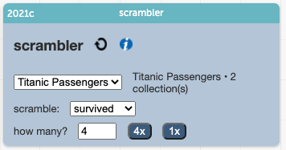
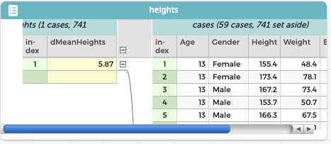
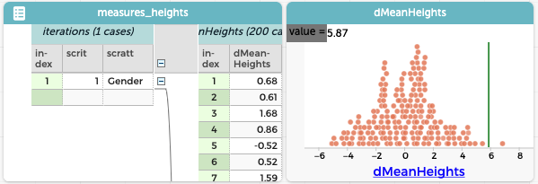

# Scrambler



2021-06-12

Here we describe the current version of the **Scrambler** plugin.

* Drag the URL for this plugin into your document.
* Prepare your dataset for scrambling (see th example below...):
    * Make a measure (a new attribute with a formula) that describes the effect you're studying.
    * Drag it left so that it's at a higher level in the hierarchy.
* Make sure the dataset you want to scramble is selected in the menu (**heights** is there by default, and that's correct).
* Choose what attribute you want to scramble (we've set it up to scramble `Gender`).
* Adjust the number and then click the buttons to create as many "scrambles" as you wish.

You can try all this yourself in [this sample document](https://codap.concord.org/releases/latest/static/dg/en/cert/index.html#shared=https%3A%2F%2Fcfm-shared.concord.org%2FjEeBNIbK29v5XwtZdmhy%2Ffile.json)

## Background and an Example

The point of scrambling is to create a _sampling distribution_ of some _measure_. 
For example, suppose that in your dataset it appears that 13-year-old boys are taller than 13-year-old girls.
You want to assess whether it's _plausible_ that the difference in means that you see could happen by chance.

To do that, you will make the "null hypothesis" real: 
you will break any association between `Gender` and `Height` by scrambling the values for one of those attributes.
Then you would look to see how different the boys and girls seem to be when the difference _is_ just chance.

But one trial is not enough. Furthermore, you have to decide what, specifically, to look at to say that the boys are taller.
In this situation, that means coming up with a number that represents how much taller the boys are. 

This is very important, and bears highlighting:

> You must create a _measure_ of the effect you're seeing. It's not enough to say that boys are taller than girls;
> You have to say _how much_ taller.
> 



In our example, we used the difference of means and called it `dMeanHeights` ---
and dragged it leftwards in th table.
The CODAP formula looks like this:

```
mean(Height, Gender="Male") - mean(Height, Gender="Female")
```

We see how much taller boys are in the data (in our case, 5.87 cm in the mean).
Then we will see how much taller they are when the data have been all scrambled. 
Because the data are randomly assigned, sometimes the difference will be positive, sometimes negative (the "girls" will be taller).

But is it plausible that 5.87 could appear by chance?

Repeat this process a few hundred times and see.
In this case, no: even though it's _possible_ that the data could be that extreme
(after all, the real data _could_ come up when you scramble),
it doesn't happen very often.


## Analyzing your results

Make a graph of the measure from the "measures" table.
You'll see the sampling distribution.
The picture shows the results from 200 scrambles. 



You want to know what proportion of those measures are more extreme than your "test statistic" 
(which in our case is 5.87, the difference in mean heights).

Here's the trick:

* In the graph, go to the "ruler" palette and press the **Movable Value** button. 
* Click "Add." A movable line appears on the plot.
* in the "ruler" palette again, click "percent."

Now you can see what percentage are on each side of the line.

Set the line to 5.87 (you might need to rescale) to see how unusual it is!
(Chances are, very few of your measures, positive or negative, are that large.)

## When Things Go Wrong

If CODAP and the Scrambler get confused, pressing the "refresh" arrow can help (it's a circular, recyle-y arrow). 
That will basically restart the scrambler.

