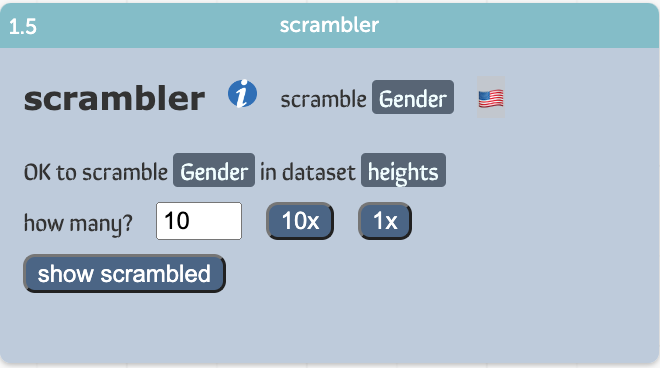

# Scrambler

## Version 1.1, October 2021
Instead of menus for choosing the dataset and scramble attribute, 
we use the new API ability to drag attributes in from CODAP itself.

So just drag the scramble attribute you want into the scrambler.
It gets the attribute name—and the dataset—from that attribute.

### Remaining annoyances
I really want to bold or `code` the names of attributes in the help strings,
but for some reason that's not working.
Jonathan suspects the css, but I can't find the problem!