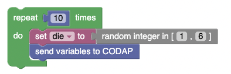

# simmer

Note: very early, proof-of-concept, 
can change radically at any time, or even vanish! 
You have been warned!

This plugin lets you use block programming to create probability simulations. 

Look for the **Send variables to CODAP** block in the **Variables** section. 
That emits whatever variables you have defined into a CODAP dataset. 

A simple die-rolling simulation might look like this:

